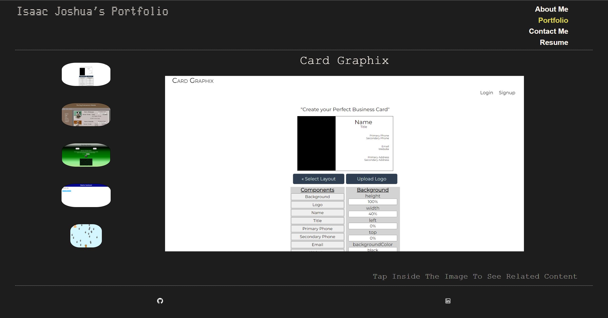

# IJ-Portfolio
## Description
My public portfolio of the work I've done

## Table of Contents
- [Usage](#usage)
- [Link and Screenshots](#link-and-screenshots)
- [Questions](#questions)

## Usage
The user can access my portfolio work by going to 'portfolio' in the nav bar, selecting a project from the list of project squares, clicking on the picture to see the description and links, and then clicking either the 'Repository' or 'Deployed' button.

## Link and Screenshots
Here is a link to the [deployed site](https://isaacjcarnes.github.io/ij-portfolio/)

## Questions
You can find me on [Github](https://github.com/IsaacJCarnes)
